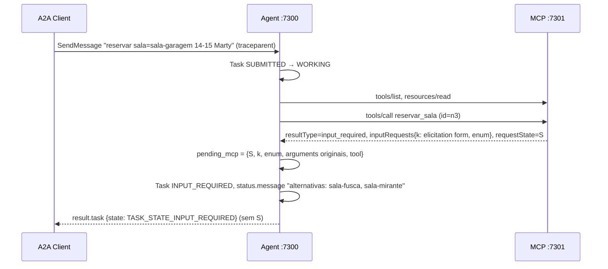
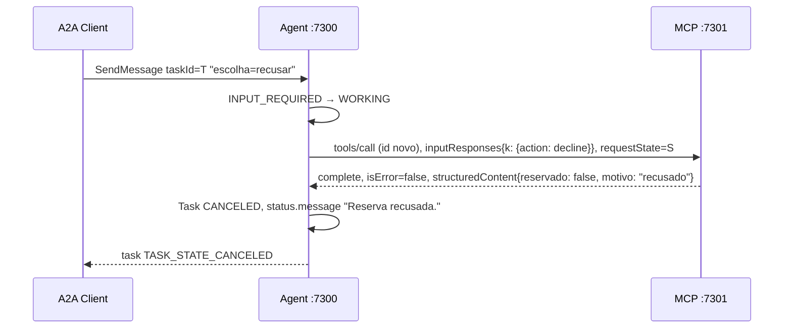

# Fluxos de protocolo

Regra transversal:

> **requestState nunca aparece no protocolo A2A externo.**
> Nem no card, nem no artifact, nem em `status.message`, nem no `history`, nem
> em mensagens de erro.

Notação: `A2A →` é o request do cliente ao agente; `MCP →` é o request do agente
ao servidor MCP. Todo request MCP leva no `_meta`:

```json
{
  "io.modelcontextprotocol/protocolVersion": "2026-07-28",
  "io.modelcontextprotocol/clientInfo": {"name": "agente-central-de-salas", "version": "1.0.0"},
  "io.modelcontextprotocol/clientCapabilities": {"elicitation": {"form": {}}},
  "traceparent": "00-<trace-id da Task>-<span novo>-01"
}
```

e os headers `MCP-Protocol-Version`, `Mcp-Method` e, em `tools/call` e
`resources/read`, `Mcp-Name`.

---

## Fluxo A — sala livre (verificações 24-26)

```text
A2A SendMessage
→ Task SUBMITTED
→ WORKING
→ MCP tools/call
→ complete
→ Task COMPLETED
→ artifact reserva
```

```mermaid
sequenceDiagram
    participant C as A2A Client
    participant A as Agent :7300
    participant M as MCP :7301
    C->>A: POST /a2a SendMessage "reservar sala=sala-porao ..." (traceparent)
    A->>A: Task SUBMITTED → WORKING
    A->>M: tools/list (id=n1)
    M-->>A: 3 tools
    A->>M: resources/read politica://uso (id=n2)
    M-->>A: "versao: 2026-11-01 ..."
    A->>M: tools/call reservar_sala (id=n3)
    M-->>A: resultType=complete, structuredContent{reserva, reservado:true, ...}
    A->>A: artifact "reserva" + politica; Task COMPLETED
    A-->>C: result.task {state: TASK_STATE_COMPLETED, artifacts:[reserva]}
```

Artifact (forma do wire 10):

```json
{
  "artifactId": "art-<hex>",
  "name": "reserva",
  "parts": [{"text": "{\"reserva\": \"res-NNNN\", \"sala\": \"sala-porao\", \"inicio\": \"...\", \"fim\": \"...\", \"responsavel\": \"Doc\", \"politica\": \"2026-11-01\"}"}]
}
```

---

## Fluxo B — sala ocupada (verificações 27-28)

```text
A2A SendMessage
→ MCP reservar_sala
→ input_required
→ requestState
→ Task INPUT_REQUIRED
→ alternativas
```



O agente **não** usa `elicitation_callback`. Ele chama `call_tool(...,
allow_input_required=True)` e recebe o `InputRequiredResult` cru.

---

## Fluxo C — continuação (verificações 29-30, 33)

```text
SendMessage(taskId)
escolha=sala-X
→ recuperar contexto da Task
→ NOVO JSON-RPC id MCP
→ inputResponses
→ requestState original
→ complete
→ Task COMPLETED
```

```mermaid
sequenceDiagram
    participant C as A2A Client
    participant A as Agent :7300
    participant M as MCP :7301
    C->>A: SendMessage taskId=T "escolha=sala-aquario"
    A->>A: sala-aquario ∉ enum → continua INPUT_REQUIRED (sem MCP)
    A-->>C: task INPUT_REQUIRED, "alternativas: sala-fusca, sala-mirante"
    C->>A: SendMessage taskId=T "escolha=sala-fusca" (traceparent)
    A->>A: INPUT_REQUIRED → WORKING
    A->>M: tools/call reservar_sala (id=n4 ≠ n3), mesmos arguments, inputResponses{k: accept sala-fusca}, requestState=S
    M-->>A: resultType=complete, structuredContent{sala: sala-fusca, reservado: true}
    A->>A: artifact; Task COMPLETED; descarta pending_mcp
    A-->>C: task COMPLETED
```

Pontos obrigatórios do retry:

1. `id` JSON-RPC **novo** (o cliente SDK gera ids incrementais por sessão; o
   retry é outro request).
2. `arguments` **idênticos** aos do primeiro `tools/call` (o binding do SDK
   rejeita diferença).
3. `inputResponses` com a **mesma chave** recebida.
4. `requestState` ecoado **sem modificação**.
5. `_meta` completo de novo (nada de sessão), com o mesmo trace-id da Task.

Concorrência (verificação 33): as Tasks A e B pausadas guardam cada uma o seu
`pending_mcp`. As continuações buscam pelo `taskId` e nunca por "último estado
pendente".

---

## Fluxo D — recusa (verificação 32)

```text
SendMessage(taskId)
escolha=recusar
→ action=decline
→ MCP retry
→ complete reservado=false
→ Task CANCELED
```



---

## Fluxo E — erro de execução (verificação 35)

```text
SendMessage "reservar sala=sala-delorean ..."
→ MCP tools/call
→ complete, isError=true, "Sala inexistente: sala-delorean"
→ Task FAILED, status.message com o texto da tool
```

## Fluxo F — Task terminal (verificação 31)

```text
SendMessage(taskId de Task COMPLETED)
→ erro JSON-RPC, sem tocar na Task, sem chamar MCP
```
