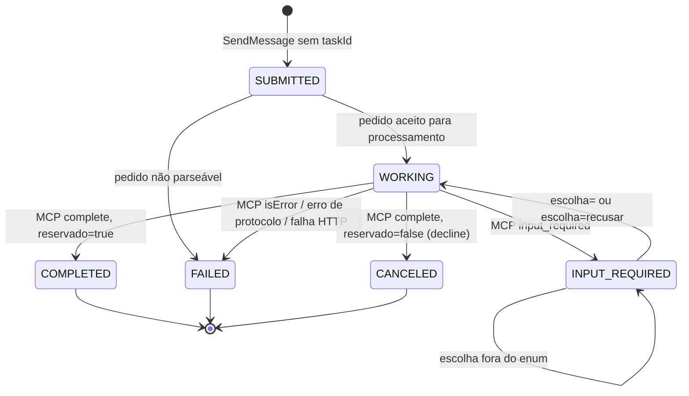
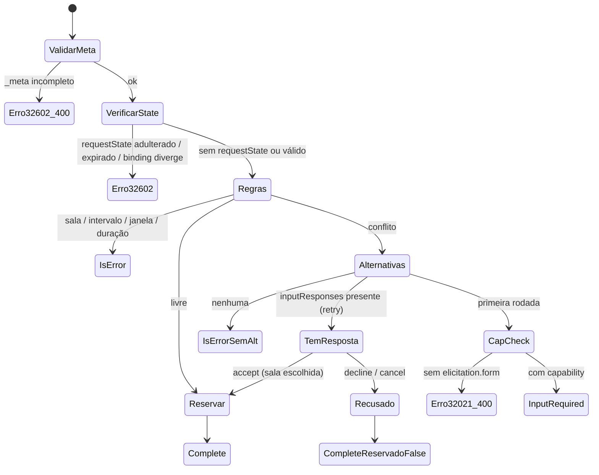

# Máquinas de estado

## 1. Task A2A

Valores no wire (A2A v1.0, enum em SCREAMING_SNAKE_CASE):

```text
TASK_STATE_SUBMITTED
TASK_STATE_WORKING
TASK_STATE_INPUT_REQUIRED
TASK_STATE_COMPLETED
TASK_STATE_FAILED
TASK_STATE_CANCELED
```

### 1.1 Diagrama



### 1.2 Fluxos

Normal (sala livre, verificação 24):

```text
TASK_STATE_SUBMITTED
        ↓
TASK_STATE_WORKING
        ↓
TASK_STATE_COMPLETED
```

Conflito (verificações 27 → 30):

```text
TASK_STATE_SUBMITTED
        ↓
TASK_STATE_WORKING
        ↓
TASK_STATE_INPUT_REQUIRED
        ↓
TASK_STATE_WORKING
        ↓
TASK_STATE_COMPLETED
```

Recusa (verificação 32):

```text
INPUT_REQUIRED
      ↓
WORKING        (retry MCP com action=decline)
      ↓
CANCELED
```

> A transição é INPUT_REQUIRED → WORKING → CANCELED, porque o agente ainda faz
> o retry MCP com `decline`: o servidor é quem conclui com `reservado: false`.
> Visto do cliente A2A (resposta síncrona), aparece como INPUT_REQUIRED → CANCELED.

Erro (verificação 35):

```text
WORKING
   ↓
FAILED
```

### 1.3 Estados terminais

```text
COMPLETED
FAILED
CANCELED
```

Nenhum deles volta a WORKING, nem a qualquer outro estado.

### 1.4 Tabela de transições permitidas

| De \ Para | SUBMITTED | WORKING | INPUT_REQUIRED | COMPLETED | FAILED | CANCELED |
|---|---|---|---|---|---|---|
| (nova) | ✔ | | | | | |
| SUBMITTED | | ✔ | | | ✔ | |
| WORKING | | | ✔ | ✔ | ✔ | ✔ |
| INPUT_REQUIRED | | ✔ | ✔ (escolha inválida) | | | |
| COMPLETED | | | | | | |
| FAILED | | | | | | |
| CANCELED | | | | | | |

Qualquer transição fora da tabela é bug. `task_model.py` deve concentrar essa
tabela e levantar exceção em transição inválida.

### 1.5 Regras de SendMessage por estado

| Estado atual da Task referenciada | Ação |
|---|---|
| (sem `taskId`) | cria Task nova |
| `taskId` inexistente | erro JSON-RPC `-32001` TaskNotFound |
| COMPLETED / FAILED / CANCELED | **erro JSON-RPC** (`-32004` UnsupportedOperation), Task inalterada |
| INPUT_REQUIRED, texto `escolha=<id ∈ enum>` | retry accept |
| INPUT_REQUIRED, texto `escolha=recusar` | retry decline |
| INPUT_REQUIRED, qualquer outro texto | permanece INPUT_REQUIRED, repete `alternativas: ...`, sem MCP |
| SUBMITTED / WORKING (continuação concorrente) | erro JSON-RPC `-32004` (não se espera no validador) |

> **SendMessage em Task terminal → erro.** (verificação 31)

### 1.6 history e status.message

- Toda mensagem do usuário que chega é anexada ao `history`. Na continuação, a
  mensagem só entra no `history` se a Task não for terminal. Na terminal, a
  resposta é erro e nada muda.
- Cada `status.message` do agente também entra no `history` (como no wire 10).
- `status.message.parts` tem **exatamente um** part de texto (verificação 36
  compara a mensagem byte a byte).

## 2. Ciclo MRTR no servidor MCP (por request)

O servidor não tem estado entre requests. A "máquina" é de um único request:



Estados de saída:

| Saída | Forma |
|---|---|
| Complete | `resultType: complete`, `structuredContent` com `reservado: true` |
| CompleteReservadoFalse | `resultType: complete`, `isError: false`, `reservado: false`, `motivo: "recusado"` |
| IsError | `resultType: complete`, `isError: true`, texto literal |
| InputRequired | `resultType: input_required`, 1 `inputRequests`, `requestState` |
| Erro32602 / Erro32021 | `error` JSON-RPC (HTTP 400 nos casos de `_meta` e `-32021`) |

> No retry com `accept`, a sala escolhida também precisa estar livre no momento
> do retry. Se ficou ocupada entre a pergunta e o retry, o servidor recalcula
> (o resolver roda de novo). Fora do escopo do validador; registrado no risco R18.
